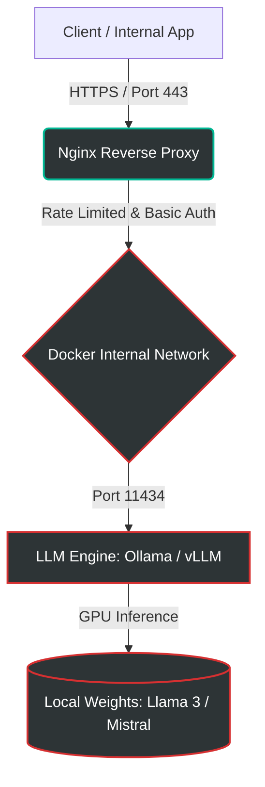

<h1 align="center">🛡️ Enterprise Private AI Infrastructure</h1>

<p align="center">
  
  
  
  
</p>

> **Secure, Air-gapped, and GPU-Accelerated Private LLM deployment using Docker and Linux.**

This repository provides a production-ready architecture for deploying Large Language Models (LLMs) locally. It eliminates the reliance on external APIs (such as OpenAI or Anthropic), ensuring absolute data sovereignty for enterprise environments. Designed for **GDPR, LGPD, and HIPAA** compliance.

---

## 🌍 Real-World Use Cases
This architecture is actively designed for enterprise clients requiring:
- **Legal & Compliance:** Processing confidential lawsuits and contracts without data leaks.
- **Healthcare Data:** Analyzing patient records safely in an air-gapped environment.
- **Corporate Knowledge:** Internal HR/Engineering chat systems with zero-trust policies.

---

## 🏗️ Architecture & Traffic Flow

The infrastructure is built on a containerized, zero-trust model. Traffic is securely routed through a reverse proxy, and the AI engine remains completely isolated from the public internet.


---
## ⚙️ Core Components & Security Principles

- **Reverse Proxy (Nginx):** Edge security, SSL/TLS termination, and DDoS mitigation.
- **Container Orchestration (Docker):** Full isolation. Inference container has no outbound internet access.
- **Zero External API Calls:** 100% of the inference runs locally on the host server.
- **No Data Retention:** Ephemeral prompt processing. Context is destroyed after the session.
---

## 💻 Hardware Requirements

To achieve real-time inference latency, the following baseline is recommended:
- **OS:** Ubuntu 22.04 LTS / Debian 12
- **GPU:** NVIDIA RTX 3090 / 4090 or Enterprise A10G/A100 (Minimum 8GB vRAM for 7B parameters).
- **Dependencies:** `docker`, `docker-compose`, and `nvidia-container-toolkit`.

---
📂 Project Structure
```
 private-ai-infrastructure/
├── docker-compose.yml       # Infrastructure orchestration
├── nginx/
│   ├── nginx.conf           # Proxy, Rate Limits, and Security Headers
│   └── certs/               # SSL Certificates (Volume)
├── scripts/
│   └── pull-models.sh       # Automated script to download weights safely
└── README.md
```

---

🚀 Deployment Guide
1. Clone the repository and navigate to the directory:
```
git clone https://github.com/welldefreitas/private-ai-infrastructure.git
cd private-ai-infrastructure
```
2. Initialize the secure Docker environment:
```
docker-compose up -d --build
```
3. Pull the required model weights (e.g., Mistral 7B) into the secure volume:
```
docker exec -it private_llm_engine ollama run mistral
```
---

⚡ 3. API Usage (Drop-in replacement for OpenAI):
```
curl -X POST https://localhost/api/generate -d '{
  "model": "mistral",
  "prompt": "Explain zero-trust architecture.",
  "stream": false
}'
```
---

<p align="center">
<b>Author:</b> <a href="https://github.com/welldefreitas">Wellington de Freitas</a> | <i>AI Security Specialist & Cloud Architect</i>
</p>
