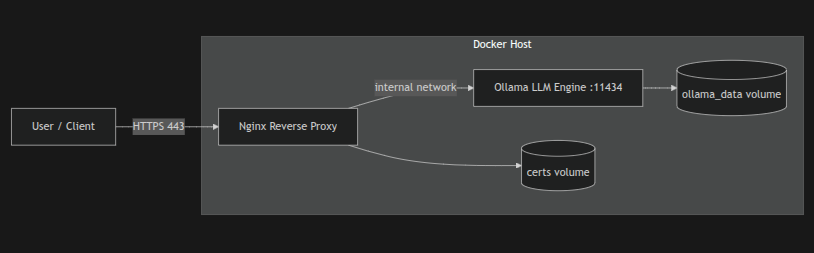

<div align="center">

# 🛡️ Enterprise Private AI Infrastructure
### Secure, hardened, and GPU-accelerated **on-prem LLM** deployment with Docker + Nginx (TLS)

[](https://github.com/welldefreitas/private-ai-infrastructure/actions/workflows/ci.yml)


**Goal:** run an enterprise-grade LLM **locally** (no public APIs) behind a **secure reverse proxy** with TLS, rate limiting, and CI security gates.

</div>

---


## ✅ What this repository delivers

- **Private LLM Engine (Ollama)** running inside an isolated Docker network (not exposed to the host)
- **Secure Nginx reverse proxy** with:
  - TLS (certs mounted via volume)
  - Rate limiting (basic anti-abuse / anti-DDoS)
  - Security headers
- **Automation scripts**:
  - Generate TLS certificates
  - Pull and store model weights locally (offline-ready)
- **Makefile** with “one-command” workflows
- **Security threat model** (`security.md`)
- **Enterprise CI**: yamllint + shellcheck + actionlint + trivy + compose smoke test

---


## 🧱 Architecture

> Rendered diagram:

<p align="center">
  
</p>

> Source diagram (Mermaid):
- `diagrams/architecture.mmd`

---

## 📦 Project structure

```text
private-ai-infrastructure/
│
├── .github/
│   └── workflows/
│       └── ci.yml
│
│       Enterprise CI/CD pipeline
│       Runs lint, security scans, and validation
│       Prevents insecure code from being merged
│
├── diagrams/
│   ├── architecture.mmd
│   │
│   │   Mermaid source diagram
│   │   Used to generate architecture visualization
│   │
│   └── architecture.png
│
│       Exported architecture diagram
│       Visual representation of secure deployment
│
├── nginx/
│   ├── nginx.conf
│   │
│   │   Secure reverse proxy configuration
│   │
│   │   Includes:
│   │   - Rate limiting
│   │   - Security headers
│   │   - TLS support
│   │   - Isolation enforcement
│   │
│   └── certs/
│
│       TLS certificates storage
│       Generated locally
│       Never committed
│
├── scripts/
│   ├── generate-certs.sh
│   │
│   │   Generates self-signed TLS certificates
│   │   Automates secure HTTPS setup
│   │
│   └── pull-models.sh
│
│       Securely downloads LLM weights
│       Stores inside protected volume
│
├── docker-compose.yml
│
│   Core infrastructure orchestration
│
│   Deploys:
│
│   - Private LLM engine
│   - Secure reverse proxy
│   - Network isolation
│
├── Makefile
│
│   Infrastructure automation commands
│
│   Enables:
│
│   make deploy
│   make start
│   make stop
│   make clean
│
│   Simplifies operational workflows
│
├── .env.example
│
│   Environment configuration template
│
│   Prevents secrets from being committed
│
├── security.md
│
│   Threat model documentation
│
│   Includes:
│
│   - attack vectors
│   - mitigations
│   - risk analysis
│
├── CHANGELOG.md
│
│   Version history
│
│   Tracks infrastructure evolution
│
├── LICENSE
│
│   MIT License
│
└── README.md
```

---

## 🚀 Quick start (local)

**1) Requirements**
- Docker + Docker Compose v2
- Linux/macOS recommended
- Optional for GPU: NVIDIA Container Toolkit (Linux + NVIDIA)

**2) Configure environment**
Copy the template:
```bash
cp .env.example .env
```
- (Edit .env if needed to change ports or models).
---
**3) Generate certificates (dev/test)**
This creates local TLS certs under `nginx/certs/` (mounted read-only to Nginx):
```bash
make certs
```
*(Edit `.env` if needed to change ports or models).*

---

**4) Start the stack**
```bash
make up
```

**5) Pull models into the local volume**
```bash
make pull-models
```

**6) Check status / logs**
```bash
make status
make logs
```

---

**7) Test the API (Drop-in replacement for OpenAI)**
Once the stack is running and the model is loaded, test the secure endpoint:

```bash
curl -k -X POST https://localhost/api/generate -d '{
  "model": "mistral",
  "prompt": "Explain zero-trust architecture in 2 sentences.",
  "stream": false
}'
```

---

## 🧰 Makefile commands

Run `make help` to see all targets. Common targets:
- `make up` / `make down` — start/stop the stack
- `make logs` — tail logs
- `make status` — show running containers
- `make certs` — generate local TLS certs (dev/test)
- `make pull-models` — download LLM weights into the Docker volume
- `make lint` — yamllint + shellcheck + actionlint
- `make scan` — Trivy filesystem scan (security gate)
- `make ci-smoke` — CI compose smoke test

---

## 🔐 Security model

This repo includes a practical threat model and mitigations in `security.md`.

**Highlights:**
- LLM engine runs on an isolated Docker network (not exposed to host).
- Only Nginx exposes ports to the host (80/443).
- Rate limiting + security headers at the edge.
- CI enforces linting + security scanning (Trivy).

---

## 🧪 CI/CD (Enterprise Gates)

The pipeline validates:
- YAML lint (`yamllint`)
- Shell scripts (`shellcheck`)
- GitHub Actions workflow lint (`actionlint`)
- Security scanning (`trivy` filesystem scan)
- Compose smoke test (docker compose with CI-safe file)

---

## ⚠️ Important notes

**Production hardening (recommended next steps):**
- Replace local TLS with ACME/Let’s Encrypt (or internal PKI).
- Add authenticated access (mTLS or OAuth2 proxy).
- Add WAF rules / stricter allowlists.
- Add outbound/egress control (host firewall / network policy) if required by compliance.

---

## 📜 License
MIT — see `LICENSE`.

<p align="center">
<b>Author:</b> <a href="https://github.com/welldefreitas">Wellington de Freitas</a> | <i>AI Security Specialist & Cloud Architect</i>
</p>
