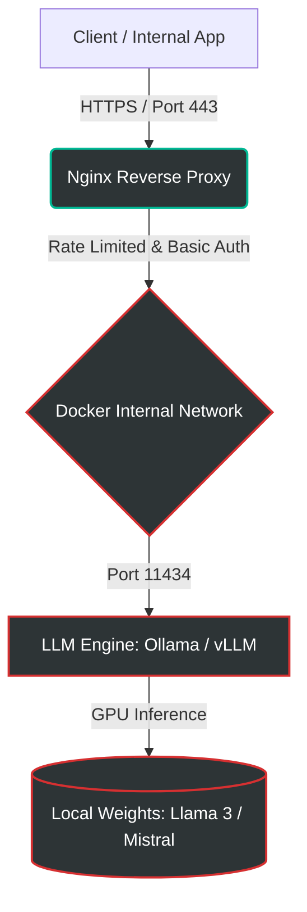

 [](https://github.com/welldefreitas/private-ai-infrastructure/actions/workflows/ci.yml)

<h1 align="center">🛡️ Enterprise Private AI Infrastructure</h1> 

<p align="center">
  
  
  
</p>


> **Secure, egress-restricted, and GPU-Accelerated Private LLM deployment using Docker and Linux.**

This repository provides a production-ready architecture for deploying Large Language Models (LLMs) locally. It eliminates the reliance on external APIs (such as OpenAI or Anthropic), ensuring absolute data sovereignty for enterprise environments. 

---

## 🏛️ Compliance & Governance Alignment
This architecture is explicitly designed to support the following regulatory frameworks and standards:
- **GDPR / LGPD / HIPAA** (Zero data retention and full data sovereignty).
- **OWASP LLM Top 10** (Mitigation of prompt injection and DoS via rate limiting).
- **Zero Trust Architecture** (Egress-blocked containers and strict proxy gating).

> **⚠️ Production Note:** This project uses self-signed SSL certificates for local/development demonstration purposes. For production deployments, these must be replaced with Corporate PKI or Let's Encrypt certificates.

---

## 🌍 Real-World Use Cases
This architecture is actively designed for enterprise clients requiring:
- **Legal & Compliance:** Processing confidential lawsuits and contracts without data leaks.
- **Healthcare Data:** Analyzing patient records safely in a network-restricted environment.
- **Corporate Knowledge:** Internal HR/Engineering chat systems with zero-trust policies.
---

## 🏗️ Architecture & Traffic Flow

The infrastructure is built on a containerized, zero-trust model. Traffic is securely routed through a reverse proxy, and the AI engine remains completely isolated from the public internet.


---
## 🛑 Threat Model & Security Controls

| Threat Vector | Mitigating Control |
| :--- | :--- |
| **Data Exfiltration** | Docker network set to `internal: true` (Total egress block). |
| **DDoS / Rate Abuse** | Nginx `limit_req_zone` applied at the edge. |
| **Prompt Leakage** | Nginx `access_log` completely disabled. Ephemeral container memory. |
| **Unauthorized Access** | Nginx configured for Basic Auth / Allowlist capabilities. |

---

## ⚙️ Core Components & Principles
- **Reverse Proxy (Nginx):** Edge security, SSL/TLS termination, and DDoS mitigation.
- **Container Orchestration:** Full isolation. Inference container has absolutely **no outbound internet access**.
- **Zero External API Calls:** 100% of the inference runs locally on the host server.

---

## 💻 Hardware Requirements
To achieve real-time inference latency, the following baseline is recommended:
- **OS:** Ubuntu 22.04 LTS / Debian 12
- **GPU:** NVIDIA RTX 3090 / 4090 or Enterprise A10G/A100 (Minimum 8GB vRAM for 7B parameters).
- **Dependencies:** `docker`, `docker-compose`, and `nvidia-container-toolkit`.

---
📂 Project Structure
```
private-ai-infrastructure/
├── .github/
│   └── workflows/
│       └── ci.yml               # Enterprise CI/CD Security & Linting pipeline
├── diagrams/
│   ├── architecture.mmd         # Mermaid architecture diagram source
│   └── architecture.png         # Exported architecture visualization
├── nginx/
│   ├── nginx.conf               # Proxy, Rate Limits, and HTTPS configuration
│   └── certs/                   # SSL Certificates (Volume)
├── scripts/
│   ├── generate-certs.sh        # Automated SSL certificate generation
│   └── pull-models.sh           # Automated script to download weights safely
├── .env.example                 # Environment configuration template
├── CHANGELOG.md                 # Version history and release notes
├── docker-compose.yml           # Infrastructure orchestration
├── LICENSE                      # Open-source MIT License
├── Makefile                     # Automation commands
├── README.md                    # Main project documentation
└── security.md                  # Threat model and security mitigations
```

---

🚀 Deployment Guide
1. Clone the repository and navigate to the directory:
```
git clone https://github.com/welldefreitas/private-ai-infrastructure.git
cd private-ai-infrastructure
```
2. Initialize the secure Docker environment:
```
docker-compose up -d --build
```
3. Pull the required model weights (e.g., Mistral 7B) into the secure volume:
```
docker exec -it private_llm_engine ollama run mistral
```
---

⚡ 3. API Usage (Drop-in replacement for OpenAI):
```
curl -X POST https://localhost/api/generate -d '{
  "model": "mistral",
  "prompt": "Explain zero-trust architecture.",
  "stream": false
}'
```
---

<p align="center">
<b>Author:</b> <a href="https://github.com/welldefreitas">Wellington de Freitas</a> | <i>AI Security Specialist & Cloud Architect</i>
</p>
